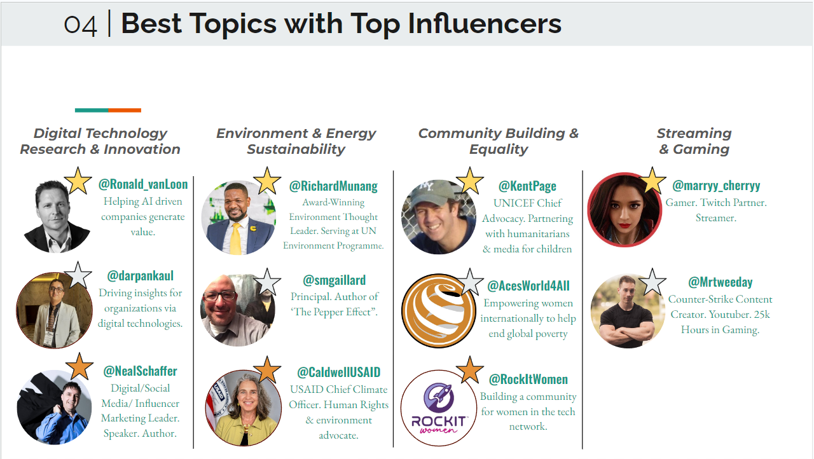

## Social Media Marketing in the age of Twitter and Natural Language Processing (NLP)

The aim of this project was inspired by the rise in the popularity of social media and its impact on consumerism and customer psychology. The objective of this project
was to be able to find the best-fit influencers on twitter to promote brands/products/ideas/ based on their profile and tweet history. These influencers need not necessarily be 
public figures, rather those with a strong following, active accounts, and high & relevant community involvment.   

## Installation

### Prerequisites
Make sure you have Python installed on your system. You can download it from [python.org](https://www.python.org/).
To install the required packages for this project, run the following command in your terminal:
```bash
pip install -r requirements.txt
```

### Setup
To set up the project, first clone the repository and change into the project directory:
```bash
git clone https://github.com/kluthra15/twitter_marketing_ML.git
cd twitter_marketing_ML
```
## Jupyter Notebooks Overview

This project includes several Jupyter notebooks, each handling a different aspect of the data science pipeline. Below is an overview of each notebook:

### Data Engineering Notebook

- **Filename:** `data_engineering.ipynb`
- **Description:** This notebook contains all the data preprocessing and cleaning steps. It includes code for data extraction, transformation, and loading (ETL).
- **How to Use:** Run each cell in sequence to perform data engineering tasks. Ensure that you have the raw data in the specified directory.

### Data Analysis Notebook

- **Filename:** `data_analysis.ipynb`
- **Description:** In this notebook, exploratory data analysis (EDA) is performed. It contains visualizations and statistical analyses to understand the data better.
- **How to Use:** Execute the cells to generate the visualizations. Modify parameters for different insights.

### Data Modeling Notebook

- **Filename:** `data_modeling.ipynb`
- **Description:** This notebook is focused on building and training the machine learning models. It includes model selection, training, and validation steps.
- **How to Use:** Follow the steps to train the models. Experiment with different model parameters to see their impact.

### Post-Modeling Analysis Notebook

- **Filename:** `post_modeling_analysis.ipynb`
- **Description:** After modeling, this notebook is used for model evaluation and interpretation. It includes performance metrics and model interpretation techniques.
- **How to Use:** Run the cells to evaluate the trained models. Review the interpretations and conclusions drawn from the models.

---

Please make sure you have all the dependencies installed (as mentioned in the Installation section) before running these notebooks. Also, adjust the paths to datasets or other resources as per your local setup.

## Business Report
Here's a glimpse into our comprehensive business report:





For the full slideshow, check out [Twitter Social Media Marking](https://docs.google.com/presentation/d/1L-0TAO3v4sfX1YKctgpnqTsOUmZP3YrqJ3tztHQy3i4/edit?usp=sharing).
